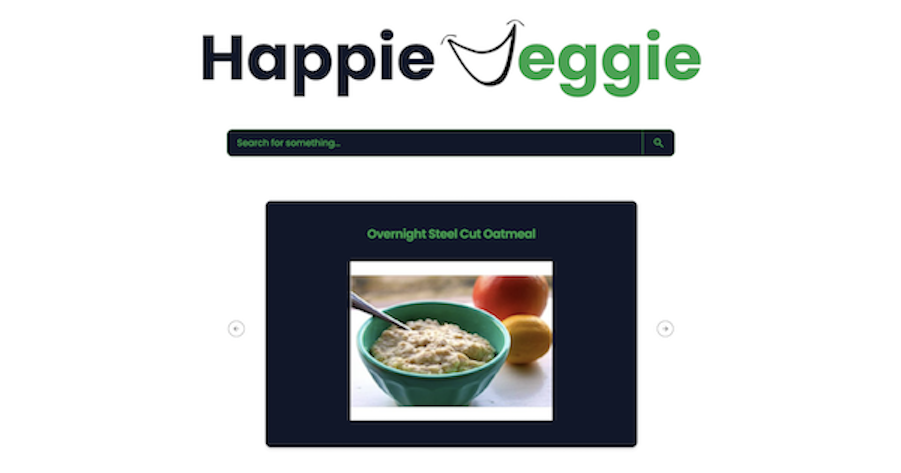

# Happie Veggie


## Description

This app, powered by [Spoonicular](https://spoonacular.com/food-api), allows you
 to search for vegetarian recipes (up to 100 per search) and consult their details.
  The app was developed with React and Typescript, while for styling the use of
   Shadcn together with Tailwind was tested.

_Note: according to Spoonicular's conditions, free use includes a limited number
 of searches per day._



## Installation

If you're using OS X or Windows, use one of the installers from the
 [Node.js download page](https://nodejs.org/en/download/). LTS versions of
  Node.js are recommended.

Clone Github repo:

```bash
git clone https://github.com/Gio-Mex/happie-veggie.git
```

Install package:

```bash
npm install
```
Now run `ng serve` for a dev server. Navigate to http://localhost:5173/
`ng build` only executes the builder for the build target in the default project
 as specified in package.json. 

## Usage 
Home page displays random recipes that you can select for details. 


If you are looking for a particular recipe, simply search for it via the
 searchbar. The app will find up to 100 relevant recipes.


## Features
- Search among thousands of vegetarian recipes
- See the details, including ingredients, equipment, and individual steps.
- Responsive design
- Powered by Spoonicular

## Demo
Try the app [here](https://happie-veggie.netlify.app).